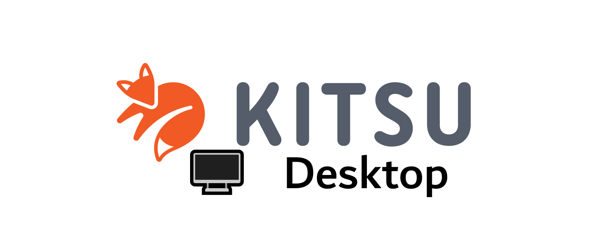

## THIS PROJECT IS DISCONTINUED 
Thanks to everyone who supported the project, but since I'm now the only one who works on it (syslambda left a few months ago), and I'm currently working on bigger projects I don't have the time, the motivation and the inspiration to continue this. If someone wants to work using kitsu-desktop for another open-source project, please @ me in the repo, or dm me on Twitter. See y'all later

- Geshi

             

  
## What is Kitsu Desktop ?
Kitsu Desktop is a cross-platform compatible desktop application that allows you to manage your anime, manga views, make a watchlist and soon, watch or download anime.   
This app is not yet affiliated to Kitsu, but we would love to see that happen <3 !    
This project is updated very regularly, and any suggestions or help is welcome.      
**To give suggestions, or participate to the project, go to the Official Discord (Soon) or send a mail to ohayo@geshii.moe !**    
        
## How to install ?
**• Public Release / Bêta**                               
Just grab a release **[here !](https://github.com/geshii/kitsu-desktop/releases)**       
<ins>Alternative download :</ins> Download at 🌲 TreeWare to plant trees (Currently offline)     
          
**• Developement Build**         
Git clone this repo with `git clone https://github.com/Geshii/kitsu-desktop.git`      
You can launch the app with `npm start` or using the <ins>Electron binairies</ins> ([click here](https://github.com/electron/electron/releases))
                          
## Want to help ?                   
You made an improvement ? Have suggestions ?         
Come with us on __Discord__ : [click here](https://chat.geshii.moe) (Maintenance ! Link is down, please send me a mail to access the server)           
Send me a mail at : <ins>ohayo@geshii.moe</ins>              
Do some PRs ! I love seeing some code suggestions and improvements !      
                     
## To Do             
• New UI (Might take time)                
• Anime downloader               
• Anime viewer / Manga reader              
• Crunchyroll, Wakanim, ADN link to auto save wich episodes you saw               
• Other improvement stuff                 
            
If you can help me for something, feel free to contact me (see the want to help section) !          
       
## Sponsors      
Currently no sponsors :3             
